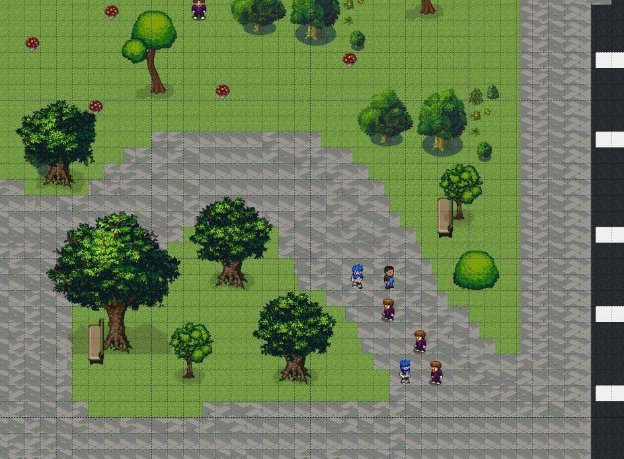
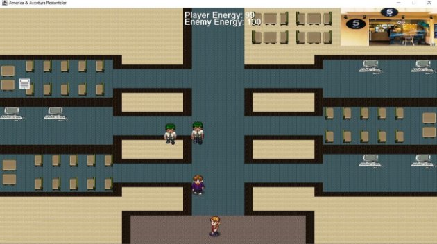
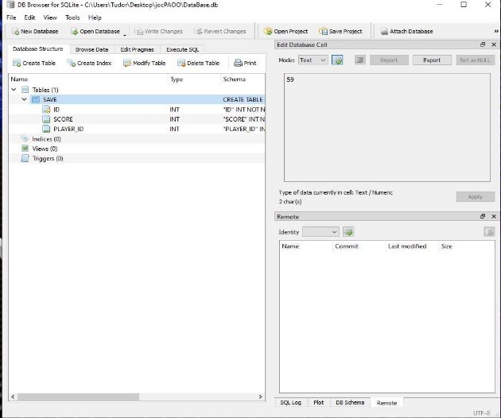

**America &Aventura Restanțelor![ref1]![ref1]![ref1]![ref2]![ref1]![ref2]![ref2]![ref1]Marian Tudor-Constantin ![ref3]![ref4]![ref5]![ref1]![ref1]![ref1]![ref1]![ref1]![ref6]![ref3]![ref4]![ref5]![ref2]![ref1]**

**1211B![ref1]![ref1]![ref6]![ref2]![ref1]**

 ![ref1]

**Proiectarea contextului și descrierea detaliată:** 

**“**America & Aventura Restanțelor” pornește de la experiența reală a personajului principal, acțiunea având loc într-o simulare a lumii reale, în două repere spațiale diferite, prima dată fiind într-un oraș, mai apoi dificultatea crescând la cadrul facultății.**   

Odată reîntors de pe minunatul tărâm al libertății, anume Statele Unite ale Americii, tânărul Tudor se află în ipostaza în care trebuie să treacă mai multe examene. Deoarece acesta “s-a jucat“ de-a facultate fix în sesiune și a dat skip mai multor examene, tocmai pentru a putea ajunge in America, acum trebuie să iasă din cămin și să susțină examenele de restanță pentru a ajunge în următorul an, anul III.   

Înarmat cu foi albe și singurul pix pe care îl are, Tudor trebuie să își facă drumul până la facultate, trecând prin campusul studențesc unde este întâmpinat de nenumărate ispite care îl distrag de la țelul său (Shaorma, Master Club, Prieteni cu chef de distracție). Odată ajuns la facultate, acesta trebuie să își plătească restanțele la Secretariat, unde este întâmpinat de secretare furioase care au nevoie de dosare cu șină. În final, protagonistul trebuie să treacă prin proba supremă,  Examenul de Restanță.   

*Meniu de start*   

**Proiectarea sistemului și descrierea detaliată:** 

Jocul este unul 2D, având loc într-un spațiu cu Three Quarters View, astfel încât atât partea de sus, cât și partea frontală a unui obiect sunt văzute în același timp, iar axa verticală indică atât înălțimea, cât și adâncimea. Jocul este unul de tip labirint, făcut pentru un singur jucător, în care acesta trebuie să își păstreze concentrare și să nu cadă pradă tentațiilor, astfel încât să poată trece nivelul.    

Meniul principal oferă jucătorului opțiunea de a alege între PLAY și QUIT:   

- PLAY : începe un joc nou   
- QUIT : părăsește jocul    

Iar atunci când se trece de primul nivel, jucătorul poate alege:   

-CONTINUE : începe următorul nivel   

-QUIT : se reia nivelul actual   

Mecanica de bază a jocului este capacitatea personajului principal de a parcurge harta, colectând bonusuri și întâlnind obstacole. Mișcarea personajului se face folosind butoanele WASD de la tastatură: W = înainte, A = stânga, S = înapoi / jos, D = dreapta. Tasta ESC este calea de escape la meniu.    

Punctele din joc sunt date de către grades ce se găsesc pe parcursul jocului, acestea făcând parte din elementele ce trebuie colectate în joc.   

Pe parcursul hărții se pot găsii diverse bonusuri atât pozitive cât și negative care îl pot ajuta pe protagonist sau care îi pot fura din concentrare:

  Papers reprezintă obiectivul protagonistului pe parcursul jocului. Acesta trebuie să le culeagă pentru a avansa nivelele.  

Berea este unu din bonusurile negative ale jocului acesta scăzând atât 

concentrarea   

cât și viteza protagonistului.   

**Proiectarea conținutului și descrierea detaliată** Game sprite-uri utilizate: 

![ref7] ![ref1]**Tudor:![ref1]** ![ref1]![ref1]![ref1]

Tudor este personajul principal al jocului și este o reprezentare fictivă a persoanei din realitate. Parcursul acestuia este definit de ocolirea obstacolelor în primul nivel și colectarea de grades în cel de al doilea nivel, urmând ca în final acesta să se lupte cu Domn Profesor.   

` `**Prieten bețiv:**   ![ref7]

Prietenul bețiv este o generalizare a tuturor prietenilor conștiincioși care au învățat când a trebuit, iar acum au timp liber în care se distrează. Bandajele sunt un detaliu care semnifică degradarea în care distracția i-a adus, la fel ca și ochii roșii.  

**Secretară furioasă:**

Secretara este unul dintre personajele celui de al doilea nivel. Protagonistul trebuie să ajungă la ea cu scopul de a-și plăti taxele de restanță, pentru a putea ajunge la inamicul final.   

**Student AC:**

Student AC reprezintă cel de al doilea caracter de la nivelul doi. Acesta se află la coada de la secretariat așteptând să își depună dosarul pentru bursa de merit. Aceștia intră în conflict cu personajul principal care nu respectă rândul și încearcă să taie coada.   

` `**Final Boss**

Final Boss reprezintă inamicul suprem al jocului și ultimul pas in calea libertății protagonistului.  

Protagonistul trebuie să demonstreze că s-a pregatit și că merită sa treacă în anul III.

**Proiectarea nivelurilor și descrierea detaliată:** 

Pentru primul nivel, dificultatea este una scăzută, protagonistul trebuind să își evite inamicii, ironic reprezentați chiar de prietenii acestuia care au nenumărat timp liber și 0 restanțe. Dacă Tudor rămâne fără concentrare, acesta pierde tot progresul făcut și jocul se reia. Atunci când el evită toate ispitele, rămâne concentrat și se încadrează în timp, se poate trece la următorul nivel.   

Pentru al doilea nivel, cadrul acțiunii se mută pe teritoriul facultății, unde protagonistul trebuie să plătească restanța la secretariat. Timpul avut de acesta fiind limitat, el trebuie să ”taie coada” intrând astfel într-un conflict cu ceilalți olimpici aflați la rând. Poate acesta să ajungă la un compromis cu ceilalți studenți și să meargă la timp la examen?   

Pentru a termina jocul, următorul nivel se desfășoară în cadrul amfiteatrului AC-02, unde Tudor se întâlnește cu inamicul final, Examenul de Restanța. Acesta trebuie să arate cât de bine sa pregătit și să răspundă la o serie de întrebări din examen.    

*Nivel 1-*   

` `*Campus Tudor Vladimirescu*  

*Nivel 2-*  

*Facultatea de Automatică și Calculatoare*  

*Nivel 2- Amfiteatru AC-02*  

**Proiectarea interfeței cu utilizatorul:** 

**Diagramă proiect** 

**Descriere clase:** 

- **Main:** 

Clasa creează o instanță de tipul Game, iar mai apoi pornește fluxul activităților prin apelul metodei StartGame() din Game.   

- **Game:** 

Rolul acestei clase este de a face inițializările(de a crea instanțe pentru jucători/inamici, pentru a inițializa harta), dar și de a menține interfața grafică. Această clasă implementează interfața Runnable pentru a avea comportamentul unui thread. În momentul apelului metodei StartGame() se instanțiază un obiect de tip Thread pe baza instanței curente a clasei Game. Obiectul de tip Thread implementează metoda run() care este apelată atunci când firul de execuție este pornit (start()). Această metodă run() inițializează jocul prin crearea unei instanțe GameView, iar mai apoi controlează numărul de cadre pe secundă printr-o buclă while și “pregătește” noua scenă (Update()) pe care o va desena pe interfața grafică (Draw()). Metoda Update() actualizează starea jocului: modifică poziția jucătorilor pe baza tastelor apăsate, schimbă poziția inamicilor, creează diferite tile-uri. Metoda Draw() va desena pe interfața grafică modificările făcute de metoda Update(). Interfața grafică este un canvas.   

- **GameWindow** 

Metoda run() a clasei Game crează o instanță a clasei GameWindow. Această clasă este responsabilă cu fereastra în care vor fi desenate obiectele pe un canvas (metoda GetCanvas care întoarce canvasul). De asemenea, avem un obiect JFrame care permite desenarea de butoane, controale, textbox-uri, etc, dar poate conține și un canvas în care pot fi desenate diverse obiecte folosind texturi.   

- **Tiles** 

Această clasă reține informații despre tile-urile (dalele) din joc. În clasa Game există o instanță a clasei Tiles, deoarece clasa Tiles conține un vector cu obiecte tot de tipul Tile, așadar în acest vector vor fi stocate toate tile-urile din joc în așa fel încat acest vector poate fi parcurs și pentru fiecare element se apelează metoda Update() și apoi Draw(). De asemenea, clasa Tiles mai reține și câte o instanță pentru fiecare sub-tip de tile (PaperTile, MapTile, PaperList).   

- **Assets** 

Conține câte un membru static de tip BufferedImage pentru fiecare tile, chiar și pentru jucători sau inamici. In acești membri sunt stocate imaginile, care vor fi desenate prin apelarea metodelor Draw() din fiecare clasa tile apelate din metoda Draw() din clasa Game. În acest exemplu este doar o imagine care conține toate texturile folosite, așadar pentru a putea instanția acest obiecte statice trebuie să decupăm fiecare textura din acea imagine. Pentru a face asta se folosește o instanță a clasei SpriteSheet în metoda Init(). Metoda folosită din SpriteSheet este crop(x, y).   

- **SpriteSheet**  

Constructorul acestei clase primește imaginea, iar clasa conține 2 membri constanți pentru înălțimea, respectiv lățimea texturilor. Metoda crop(x, y) primește doi parametri, x specifică pe ce coloană se află textura pe care dorim să o decupăm în imaginea cu toate texturile, iar y specifică linia. Pentru a afla efectiv poziția în imagine se determină pixelii de unde încep texturile de interes prin înmulțirea liniei/coloanei cu înălțimea, respectiv lățimea texturilor. Astfel se obține colțul din stânga sus al texturii, iar pentru a afla celelalte colțuri se folosesc înălțimea, respectiv lățimea.   

- **Image Loader** 

Înainte de a extrage fiecare textură, imaginea cu toate texturile trebuie să fie citită dinmemorie, iar pentru asta se folosește clasa ImageLoader cu metoda statică LoadImage(path) care primește ca parametru calea către imagine în memoria calculatorului.

**Șabloane de Proiectare:** 

- **Singleton:** Acest șablon de proiectare este unul creational care permite asigurarea unei singure instanțe a unei clase, oferind un punct gloval la această instanță. Acesta este folosit în clasa **DBHandler** care este folosită la conexiunea jocului cu o bază de date. Această clasă crează baza de date și stochează informații referitoare la scorurile diverșilor jucători.**  
- **Template Method:** Este un model comportamental care 

  definește scheletul unui algoritm din superclasă, dar permite 

  subclaselor să suprascrie pașii specifici ai algoritmului fără a-și 

  schimba structura. Acest șablon este aplicat in proiect în două 

  locuri distincte în clasa **Character** cât și în clasa **Tile**.**  

Clasa Character este implementată de mai multe sublclase precum **Player**, **DrunkFriend** sau **Student**, iar Tile este implementata de **BeerTile** și **PaperTile**, care reprezintă obiecte pe care jucatorul le culege de pe jos.  

- **State:** Acest șsblon este unul comportamental care permite unui obiect să-și modifice comportamentul când starea sa internă se schimbă. Acest lucru dă impresia că obiectul și-a schimbat clasa. În proiect acest pattern este folosit în clasa **Game** și este folosit pentru a face tranziția de la meniul jocului 

  la jocul propriu-zis, la finalul jocului, dar și la o pagină suplimentară ce prezintă diferite informații referitoare la nivelul la care jucătorul se află.**  

**Baze de Date:**  

În baza de date se salvează highest score. 

**Resurse bibliografice:** 

- [https://www.pngegg.com/  ](https://www.pngegg.com/) 
- [https://opengameart.org/  ](https://opengameart.org/) 
- [https://www.google.com/imghp?hl=EN  ](https://www.google.com/imghp?hl=EN) 
- [https://sanderfrenken.github.io/Universal-LPC-Spritesheet-C](https://sanderfrenken.github.io/Universal-LPC-Spritesheet)haracterGenerator

[ref1]: readme/Aspose.Words.40b92d98-aa06-4fa0-b59e-761c7882eacc.001.png
[ref2]: readme/Aspose.Words.40b92d98-aa06-4fa0-b59e-761c7882eacc.006.png
[ref3]: readme/Aspose.Words.40b92d98-aa06-4fa0-b59e-761c7882eacc.009.png
[ref4]: readme/Aspose.Words.40b92d98-aa06-4fa0-b59e-761c7882eacc.010.png
[ref5]: readme/Aspose.Words.40b92d98-aa06-4fa0-b59e-761c7882eacc.012.png
[ref6]: readme/Aspose.Words.40b92d98-aa06-4fa0-b59e-761c7882eacc.007.png
[ref7]: readme/Aspose.Words.40b92d98-aa06-4fa0-b59e-761c7882eacc.021.png
